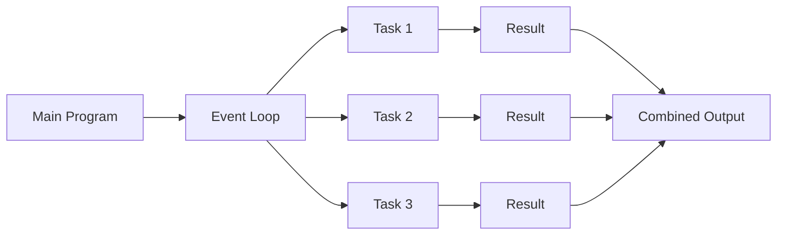
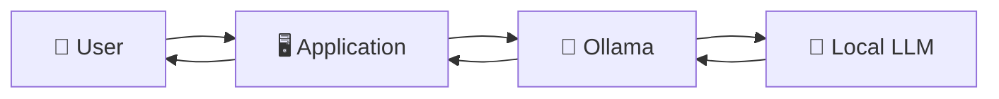
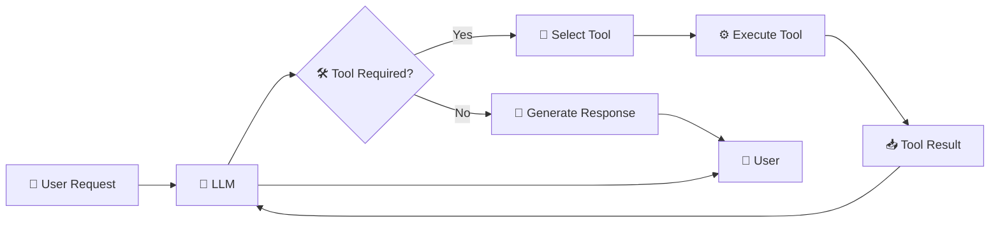
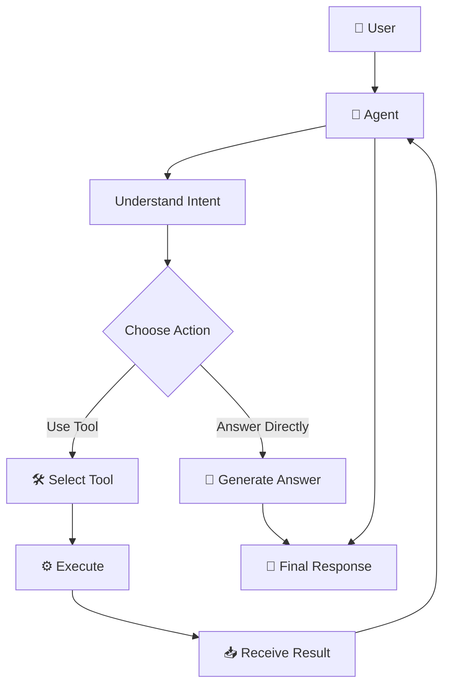
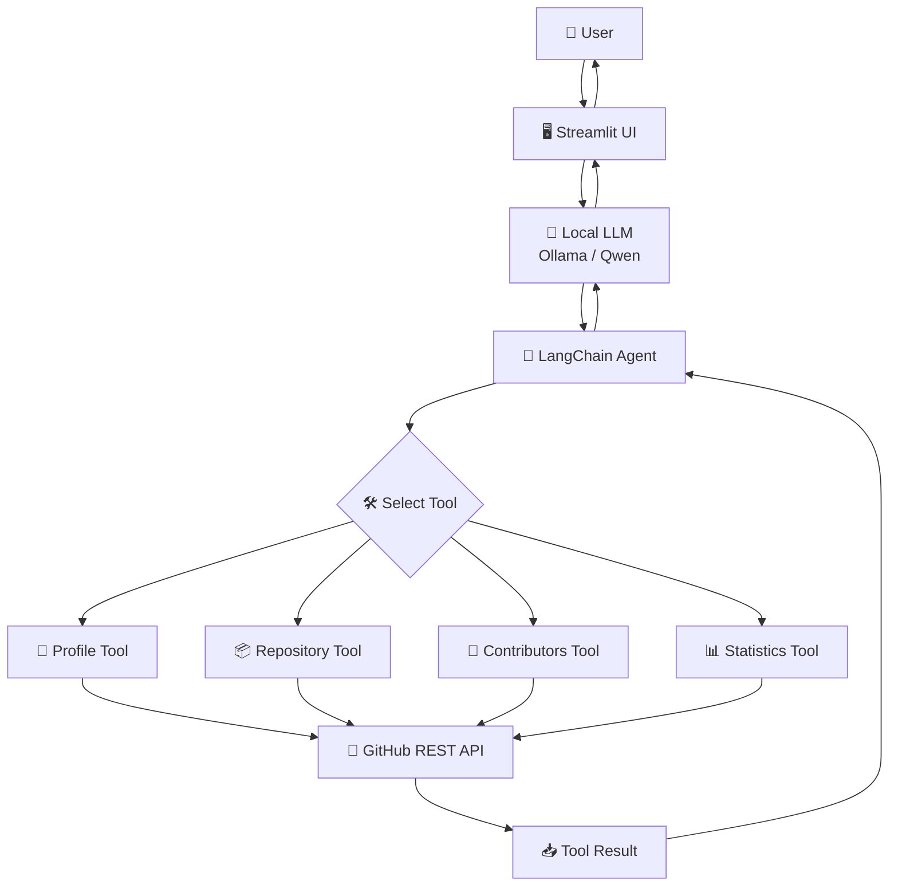
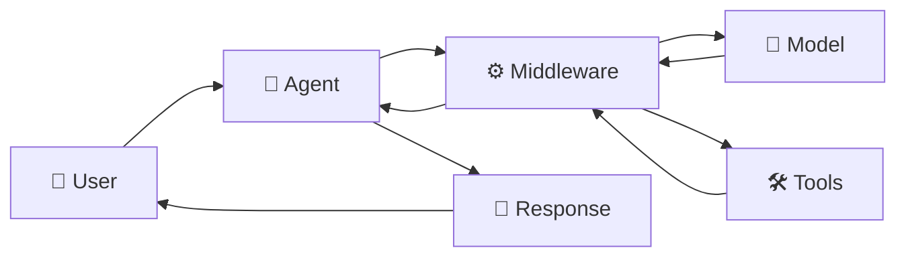
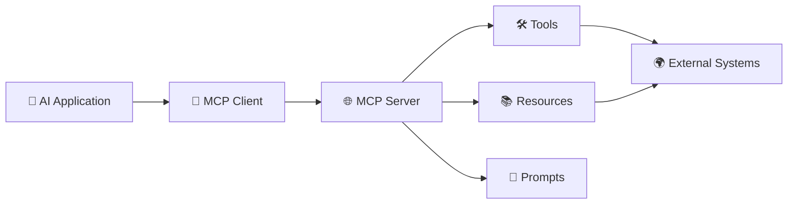
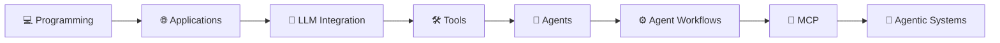

# CODENOIDS - AGENTIC AI ENGINEERING TRAINING 2026

### From Python fundamentals to intelligent AI agents.

A hands-on exploration of **Agentic AI, Large Language Models, tools, APIs, asynchronous programming, and intelligent workflows**, developed during my **3rd-year industrial training at Codenoids, Karnal, Haryana**.

This repository captures my learning journey through **16 days of practical development**, experiments, problem-solving, and AI application building — progressing from Python and DSA fundamentals to **LLM-powered agents, tool calling, middleware, and MCP**.

---

## ✨ About the Training 

**AGENTIC AI ENGINEERING TRAINING** is more than a collection of training exercises.

It represents my transition from writing traditional programs to understanding how **AI systems can reason, interact with tools, consume external information, and perform tasks autonomously.**

Throughout the training, I worked with modern technologies including **Python, AsyncIO, React, FastAPI, Streamlit, Ollama, LangChain, GitHub APIs, AI Agents, Middleware, MCP, and FastMCP.**

### 🧭 Learning Journey


---

# 🎯 Training Objectives

The training focused on building a practical understanding of modern AI application development.

### Key objectives

* Strengthen Python programming and problem-solving skills
* Understand asynchronous programming and concurrent execution
* Build APIs and backend services using FastAPI
* Explore modern frontend development with React
* Develop interactive AI applications using Streamlit
* Run and experiment with local LLMs using Ollama
* Understand LangChain and LLM application architecture
* Create custom tools for AI models
* Implement tool calling and structured inputs
* Understand AI agent workflows
* Explore LangChain middleware
* Work with external APIs and real-world data
* Understand MCP and FastMCP
* Build practical Agentic AI applications

---

# 🛠️ Technology Stack

### Programming


### AI & Agentic AI


### Backend & APIs


### Frontend & Applications


### Tools & Integration


Other technologies explored:

**AsyncIO • HTTPX • Pydantic • GitHub REST API • FastMCP • UV • PIP • WSL/Ubuntu**

---

# 🧠 Core Concepts Explored

## 🐍 Python & Problem Solving

The training started with strengthening programming fundamentals and solving algorithmic problems.

Topics included:

* Python fundamentals
* Object-Oriented Programming
* Data Structures & Algorithms
* Recursion
* Backtracking
* Linked Lists
* Stacks & Queues
* BFS
* Grid traversal
* Two-pointer techniques
* LeetCode problem solving

---

## ⚡ Asynchronous Programming

A major focus was understanding how Python can efficiently handle multiple operations without blocking execution.

### Concepts explored

* Synchronous vs asynchronous execution
* Event loops
* Coroutines
* `async` / `await`
* `asyncio`
* Tasks
* Concurrent execution
* `asyncio.gather()`
* Error handling
* Failure strategies
* Asynchronous API requests

### Simplified workflow



---

# 🌐 Web & Backend Development

The training also introduced modern web development concepts and backend architecture.

### Frontend

* React
* Vite
* Tailwind CSS
* Components
* Routing
* Responsive interfaces

### Backend

* FastAPI
* Uvicorn
* REST APIs
* HTTP methods
* HTTP status codes
* HTTPX
* API integration

### Web Concepts

* Cookies
* Local Storage
* Session Storage
* Client-server communication
* API requests and responses

---

# 🧠 Generative AI & LLMs

The next stage of the training focused on understanding how Large Language Models can be integrated into applications.

### Technologies

* Ollama
* Qwen
* LangChain
* Local LLMs
* Prompt Engineering
* Structured outputs
* Tool calling

Using **Ollama**, I explored running LLMs locally and connecting them to Python applications.



---

# 🔗 LangChain

LangChain became an important part of the training for understanding how LLM applications can be structured.

### Concepts explored

* Models
* Prompts
* Messages
* Tools
* Tool calling
* Structured tool inputs
* Pydantic schemas
* Agents
* Agent invocation
* Middleware

---

# 🛠️ Tools & Tool Calling

One of the key concepts explored was allowing an LLM to interact with external functionality instead of generating text alone.

### Basic workflow



This forms the foundation for building applications where an AI model can interact with APIs, databases, services, or other software systems.

---

# 🤖 AI Agents

The training progressed from individual tools to **AI agents**.

An agent can determine:

1. What the user wants
2. Whether a tool is required
3. Which tool should be used
4. What information needs to be passed to it
5. How to use the returned result
6. What response should be provided to the user

### Agent workflow



---

# 🚀 Featured Project

# 🤖 GitHub Assistant

One of the main projects developed during the training was a **natural-language GitHub Assistant**.

The project explores how an LLM can interact with GitHub through custom tools and the GitHub REST API.

Instead of manually navigating GitHub, a user can ask questions in natural language and allow the AI system to determine which tool should be used.

---

## 💡 What It Can Do

The assistant was designed to work with GitHub information through tools such as:

* 👤 Profile information
* 📦 Repository information
* 👥 Contributor information
* 📊 Repository statistics
* 🔍 GitHub data retrieval
* 🔗 GitHub API interaction

---

## 🏗️ GitHub Assistant Architecture



---

## 🔄 Example Agent Interaction

```text
User:
"Tell me about the repositories of this GitHub user."

                ↓

            🤖 Agent

                ↓

       Understand the request

                ↓

        Select GitHub Tool

                ↓

          🐙 GitHub API

                ↓

          Retrieve data

                ↓

        Return tool result

                ↓

        🧠 LLM processes it

                ↓

       💬 Natural-language answer
```

---

# 🧮 AI Calculator Agent

Another smaller project was developed to understand the fundamentals of **tools, structured inputs, and agent invocation**.

### Concepts demonstrated

* Custom LangChain tools
* `@tool` decorator
* Pydantic
* Structured arguments
* Tool validation
* Agent creation
* Agent invocation
* Ollama
* Streamlit
* Error handling

The project helped establish the connection between:

```text
User → LLM → Tool → Result → LLM → Response
```

---

# ⚙️ Middleware

The training also explored **LangChain middleware** and how middleware can influence or monitor the behavior of an AI system.

Concepts explored included:

* Middleware architecture
* Model selection
* Tool-call monitoring
* Dynamic behavior
* Request/response processing
* Agent customization

### Conceptual architecture



---

# 🔌 MCP & FastMCP

Towards the later stages of the training, I explored **Model Context Protocol (MCP)** and **FastMCP**.

MCP provides a standardized approach for connecting AI applications with external tools and resources.

### MCP architecture



This introduced the idea of creating more modular and interoperable AI systems.

---

# 🗓️ Training Roadmap

| Day    | Focus                                   |
| ------ | --------------------------------------- |
| **01** | Python + DSA                            |
| **02** | String & Problem Solving                |
| **03** | Python + DSA                            |
| **04** | Asynchronous Programming                |
| **05** | Async Task Management                   |
| **06** | BFS + Stack Problems                    |
| **07** | Python Environment + LangChain + Ollama |
| **08** | Linked Lists + Backtracking             |
| **09** | React + Tailwind CSS                    |
| **10** | FastAPI + Uvicorn                       |
| **11** | Web Concepts + Python Decorators        |
| **12** | Streamlit + Ollama + GitHub APIs        |
| **13** | LangChain Tools + Pydantic + Agents     |
| **14** | LangChain Middleware                    |
| **15** | Agent Workflows + Tool Integration      |
| **16** | MCP + FastMCP                           |

---

# 📂 Repository Structure

```text
agentic-ai-lab/
│
├── Day 01/
│   └── Python & DSA
│
├── Day 02/
│   └── Problem Solving
│
├── Day 03/
│   └── Python & DSA
│
├── Day 04/
│   └── Async Programming
│
├── Day 05/
│   └── Async Tasks
│
├── Day 06/
│   └── BFS & Stack Problems
│
├── Day 07/
│   └── LangChain + Ollama
│
├── Day 08/
│   └── Linked Lists & Backtracking
│
├── Day 09/
│   └── React + Tailwind
│
├── Day 10/
│   └── FastAPI
│
├── Day 11/
│   └── Web Concepts + Decorators
│
├── Day 12/
│   └── GitHub Assistant
│
├── Day 13/
│   └── LangChain Tools & Agents
│
├── Day 14/
│   └── Middleware
│
├── Day 15/
│   └── Agent Workflows
│
├── Day 16/
│   └── MCP + FastMCP
│
└── README.md
```

---

# 📈 Learning Progression

The training can be summarized as a progression from **traditional programming → AI application development → agentic systems**.



---

# 💭 Key Takeaways

This training helped me understand the shift from applications that simply **execute predefined instructions** to systems where AI can **reason over a task, select tools, interact with external systems, and generate context-aware responses.**

### I gained hands-on experience in:

* Python development
* DSA and problem solving
* Asynchronous programming
* REST API development
* FastAPI
* React
* Streamlit
* Local LLMs
* Ollama
* LangChain
* Tool calling
* AI agents
* Middleware
* GitHub API integration
* MCP
* FastMCP
* AI application architecture

---

# 🌱 What This Repository Represents

This repository represents a **16-day progression in AI engineering**.

It started with writing Python programs and solving DSA problems and gradually moved toward building applications where **LLMs interact with tools, APIs, and external systems**.

The most valuable part of the experience was not just learning individual technologies, but understanding how they can work together to build practical AI-powered systems.

---

# 👩‍💻 About Me

### Tanisha Chaudhary

**B.Tech Computer Science & Engineering**

Interested in:

`Backend Development` • `Artificial Intelligence` • `Agentic AI` • `Cloud` • `Python`

---

## ⭐ Explore the Journey

If you're exploring **Agentic AI, LangChain, local LLMs, AI agents, tool calling, or MCP**, feel free to explore the implementations and experiments throughout this repository.

> **Learn → Build → Experiment → Break → Understand → Build Better.**

---

